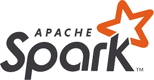
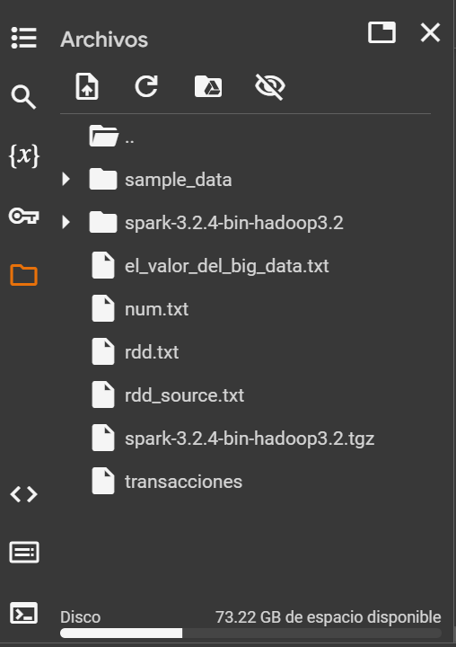
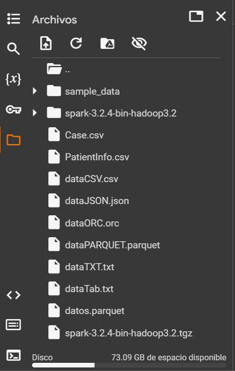
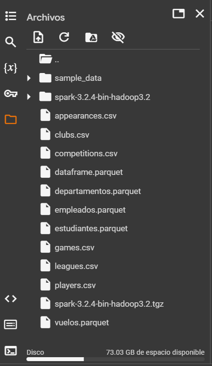
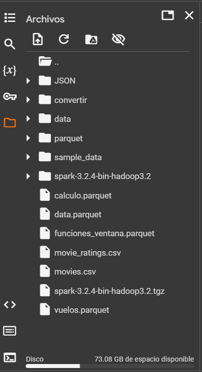

<section id="inicio" align="center">
    <h1>All About Spark</h1>
    
    
<b>(From Zero to Little Ninja)</b>

</section>

<h2>Proyecto para aprender Spark con Notebooks</h2>

### Tabla de Contenidos:

- [**Información del proyecto**](#información-del-proyecto)
- [**Prerrequisitos**](#prerrequisitos)
- [**Información adicional**](#información-adicional)
- [**Recomendaciones**](#recomendaciones)
- [**Cómo contribuir**](#cómo-contribuir)
- [**Autor**](#autor)

## **Información del proyecto**

El proyecto es una recopilación de teoría y ejercicios sobre Spark, con PySpark y Spark SQL, para aprender con notebooks leyendo y practicando. 

En cuanto al conjunto de datos que se utilizan en los notebooks, se encuentran en la carpeta data y se pueden cargar en el cuadro de archivos de Google Colab.

La estructura en el cuadro de archivos debería verse así para cada notebook:

- **Notebook de Spark_PySpark_RDD**

- **Notebook de Spark_SQL_1 (Básico)**

- **Notebook de Spark_SQL_2 (Avanzado)**

- **Notebook de Spark_SQL_3_Funciones**

## **Prerrequisitos**

Si bien comienza desde cero, y los notebooks tienen teoría y práctica, es recomendable conocer Python y SQL para mejorar la curva de aprendizaje.

## **Información adicional**

Nada por el momento, luego ampliaré.

## **Recomendaciones**

Hasta el momento, la mayor parte de este material lo fui tipeando en los notebooks y lo extraje del curso de Udemy de José Miguel Moya, un auténtico experto en Spark que recomiendo ver:

- [Curso de Spark en Udemy](https://www.udemy.com/course/big-data-y-spark-ingenieria-de-datos-con-python-y-pyspark) 

Udemy tiene rebajas en el año, dónde los cursos llegan a valer hasta 10 dólares. Vale la pena comprar este curso.

Por otro lado, nada mejor que la documentación oficial, que dejo a mano y siempre es bueno consultar:

- [Página Oficial de Apache Spark](https://spark.apache.org/)

## **Cómo contribuir**

Si la mejora o la contribución es relevante, acepto pull request para ampliar el proyecto, pero de momento no tengo ningún formato en específico.

## **Autor**

  

  <h3>¡Hola, mi nombre es <b><i>Nahuel</i></b> 👋🏽!!  </h3>
  
Soy de Buenos Aires (Argentina) y tengo formación en desarrollo con Python, Ingeniería y Ciencia de Datos. Me desempeño como Data Engineer en una empresa consultora, aunque en mi trabajo diario hago tanto ingeniería de datos como ciencia de datos, machine learning y desarrollo con Python.
   
  Amo el mundo de los datos pero también el desarrollo. Actualmente, estudio Ingeniería en Sistemas, y en mis momentos libres dedico gran parte de mi tiempo a seguir aprendiendo nuevas tecnologías, como así también a practicar y reforzar mi stack como Ingeniero de Datos.

Si quieres saber más sobre mí, puedes ir a mi perfil de GitHub:

  
💬 Siéntete libre de ponerte en contacto conmigo:

&nbsp;
&nbsp;

 

  
Desarrollado con 💙 por <i><b>NaLo Dev ထ</b></i>

 

